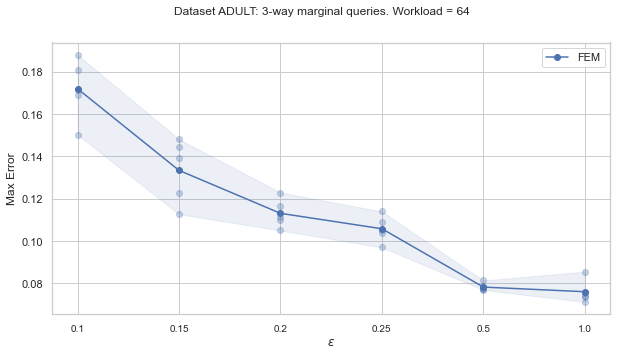
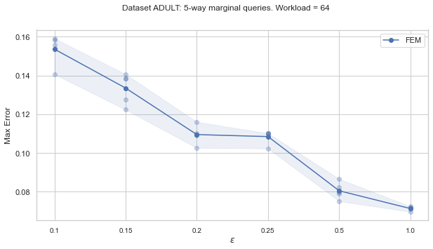
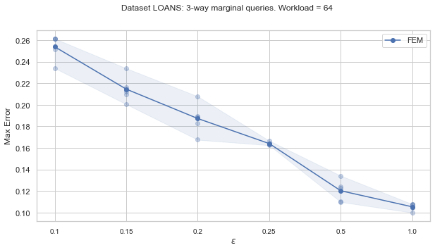
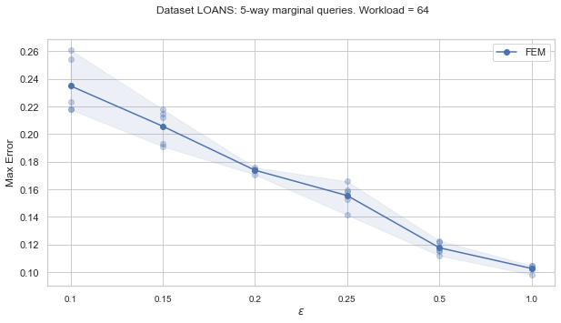

# New oracle-efficient algorithms for private synthetic data release

This is the code repository accompanying the paper [New Oracle-Efficient Algorithms for Private Synthetic Data Release](https://arxiv.org/abs/2007.05453) by [Giuseppe Vietri](https://sites.google.com/umn.edu/giuseppe-vietri/home), Grace Tian, [Mark Bun](https://cs-people.bu.edu/mbun/), [Thomas Steinke](http://www.thomas-steinke.net/), [Zhiwei Steven Wu](https://zstevenwu.com/).

If you have any questions feel free to email [Giuseppe Vietri](https://sites.google.com/umn.edu/giuseppe-vietri/home).

Abstract:

We present three new algorithms for constructing differentially private synthetic data---a sanitized version of a sensitive dataset that approximately preserves the answers to a large collection of statistical queries. All three algorithms are \emph{oracle-efficient} in the sense that they are computationally efficient when given access to an optimization oracle. Such an oracle can be implemented using many existing (non-private) optimization tools such as sophisticated integer program solvers. While the accuracy of the synthetic data is contingent on the oracle's optimization performance, the algorithms satisfy differential privacy even in the worst case. For all three algorithms, we provide theoretical guarantees for both accuracy and privacy. Through empirical evaluation, we demonstrate that our methods scale well with both the dimensionality of the data and the number of queries. Compared to the state-of-the-art method High-Dimensional Matrix Mechanism \cite{McKennaMHM18}, our algorithms provide better accuracy in the large workload and high privacy regime (corresponding to low privacy loss ε).

# Setup 
create a conda environment 
````
conda create -n fem
conda activate fem
````
Install some packages 
```
conda install numpy 
conda install pandas
conda install -c conda-forge tqdm
conda update scipy
pip install gpyopt
```

Install gurobipy (https://www.gurobi.com/gurobi-and-anaconda-for-windows/)
````
conda config --add channels http://conda.anaconda.org/gurobi
conda install gurobi
````

# Execution
You can run FEM with the following command:
```
cd /home/FEM
python fem.py <dataset> <workload> <marginal> <epsilon_split> <noise_multiple> <samples> <epsilon> 
```
For example
````
python fem.py adult 24 3 0.002 0.05 100 0.1
````

Optimize FEM
````
python hyperparameter_search/fem_bo_search.py adult 32 3 0.1
````

# Results
The following plots show the performace of FEM on dataset 
ADULT and LOANS for 3-way and 5-way marginal queries with a fix workload size of 64.
The solid line represents the average of 5 runs. 
of FEM. 

The first step to reproduce these results is to find the optimal hyperparameters 
using the run_fem_grid_search.sh scrip.
```
sh run_fem_grid_search.sh
```

The results of the grid search were then used to define the parameters in run_fem.sh.
The next step is to run
```
sh run_fem.sh
```






